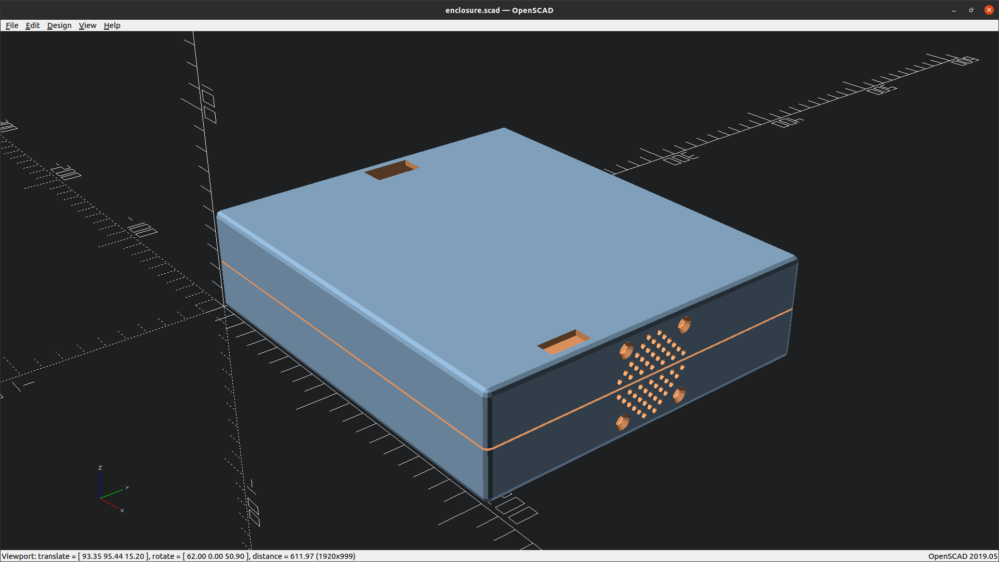
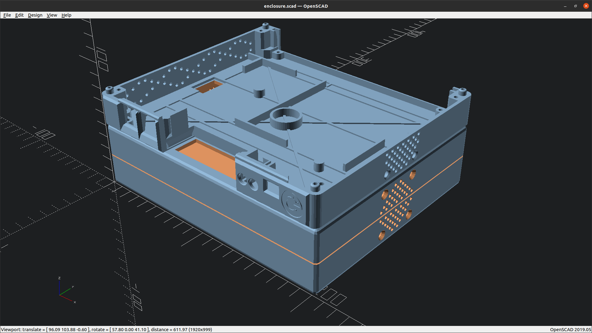

This is a simple concept of an expansion enclosure for the MISTer Multi System
case.

It's designed in OpenSCAD and is intended to sit underneath the MMS case:

It's configurable for it's height, images above are 50mm and the cutout's on
the top can be turned off if required - the ones here matches those on the MMS case
although there is an additional one for under the SNAC/Dust cover if needed.

There's the option of placing a similar fan to the one in the main case present
and a slot at the back for a backing plate.

# This is a work in progress, so it's not complete in any manner!

## Generating STL's

You need OpenScad installed and on the command line, preferably 2021.01 or later.
Edit the root Makefile and edit the following lines with the location of your install:

    export OPENSCAD      = OpenSCAD-2021.01-x86_64.AppImage
    export OPENSCAD_OPTS = --export-format binstl

Here I have an AppImage in my path so I'm using that directly.

### Using earlier versions of OpenSCAD
You can use versions earlier than 2021.01 but if you do and the build fails due to the
`--export-format` option not being recognised then remove it from `OPENSCAD_OPTS`.
This will, however, mean you are generating Ascii STL's not Binary ones which are
about 5 times the size.

## Running the build

To generate the STL's simply run

    make clean all

All the possible combinations will be generated in the build directory.

### Concurrent renders
This will take a while but if you have the CPU and Memory capacity use the -j option to
make so that multiple renders are done at the same time.

For example:

    make -j8 clean all

will render 8 stl's at the same time.

This will reduce the time taken.
For example a single threaded build takes approximately 10 minutes but on my machine -j32 takes just 36 seconds.

Just make certain the value you pick is less than the number of cores/threads available on your CPU.

## File name convention

The generated stl's have the following naming convention:

Name of the part, `top`, `base` or `plate`

Then a `_` delimited list of the options applied.

For example, `top_tc_tp_bf.stl` is the top part with top cutouts, pins & back plate.

These are the current options:

| Option | Description                                                                           | Applies to |
| ------ |---------------------------------------------------------------------------------------|------------|
| tc | Cutout top access points for cables to go though                                      | top        |
| sc | Optional cutout under the SNAC port / dust cover                                      | top        |
| tp | Add pegs on the top to stop MMS from sliding off | top        |
| bc | Optional base access points for cables to go though, for stacking multiple enclosures | base       |
| bf | Space for a faceplate at the back | top base   |
| ff | Space for a faceplate at the front | top base   |

## Customising

There's one more configurable setting which is the **external** height of the enclosure.
It defaults to 50mm but if you want to increase that height then edit `global.scad` and change the
`height` variable.

Do not reduce the height below 50mm otherwise the fan will not fit.

All released STL's are with the default height.
