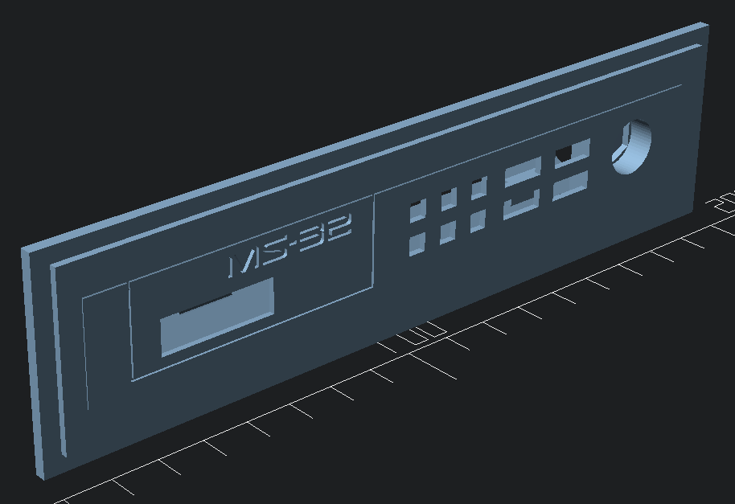

# Faceplate for the Minisynth 32

This is a custom faceplate to allow the [Minisynth 32](https://github.com/grantek/minisynth32)
to be installed inside our MMS expansion enclosure.

For this to work you need to get [face.stl](https://github.com/grantek/minisynth32/blob/main/3d_models/face.stl)
from that project and save in this directory before opening faceplate.scad in OpenSCAD.

When used with the enclosure it should look like this with the MMS on top.

Note: This has not been printed, but was done after a thread in the RMC Discord.
